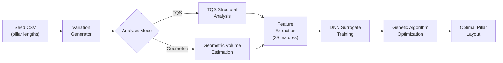
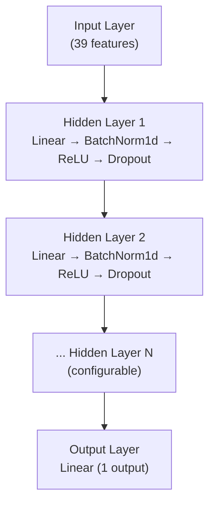
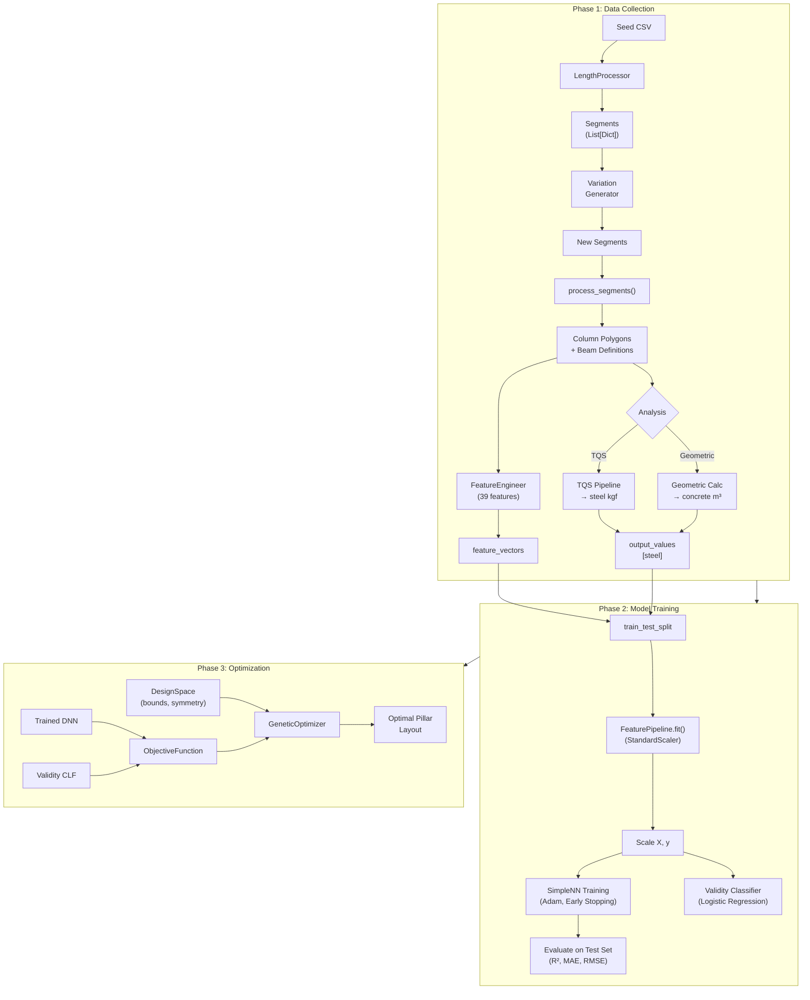

# BuildingOptimization — System Methodology & Architecture

A comprehensive technical reference for the Building Structure Optimization project, organized to support thesis methodology writing.

---

## 1. System Overview

The system optimizes **reinforced concrete building pillar layouts** by coupling a **Deep Neural Network (DNN) surrogate model** with a **Genetic Algorithm (GA)** optimizer. Instead of running expensive TQS structural analyses for every candidate design, the DNN learns to predict steel reinforcement quantities from geometric features, enabling rapid cost evaluation during optimization.



**Three-phase workflow:**

| Phase | Purpose | Key Module |
|-------|---------|------------|
| **1 — Data Collection** | Generate structural variations and analyze them | `main.py` → `_collect_training_data` |
| **2 — Surrogate Training** | Train DNN + validity classifier | `main.py` → `_train_and_evaluate` |
| **3 — Optimization** | Minimize cost via GA using surrogate | `run_optimization.py` → `GeneticOptimizer` |

---

## 2. Input Representation

### 2.1 Seed CSV Format

Structural configurations are defined as **wall segments** with lengths. Each segment represents a pillar wall face with coordinates and a length value.

- **File**: [BuildingConfig seed CSV](file:///d:/Trabalho/01_Desenvolvimento/TESTES%20IA/Python%20program/BuildingOptimization/data) (e.g., `Building1.csv`)
- **Schema**: Defined in [vector_config.py](file:///d:/Trabalho/01_Desenvolvimento/TESTES%20IA/Python%20program/BuildingOptimization/config/vector_config.py) — `VectorConfig.SEGMENTS` lists wall segment definitions; `VectorConfig.COLUMN_NAMES` provides CSV headers

### 2.2 Two Input Formats

| Format | Processor | Description |
|--------|-----------|-------------|
| **Vector Lengths** | [LengthProcessor](file:///d:/Trabalho/01_Desenvolvimento/TESTES%20IA/Python%20program/BuildingOptimization/geometry/length_input_processor.py) | Reads continuous length values from CSV → derives column polygons & beam definitions |
| **Binary Grid** | [BinaryProcessor](file:///d:/Trabalho/01_Desenvolvimento/TESTES%20IA/Python%20program/BuildingOptimization/geometry/binary_input_processor.py) | Reads binary presence/absence flags → groups connected segments into structural elements |

Both processors output: `(List[Polygon], List[Dict])` — column polygons and beam definitions.

---

## 3. Data Generation (`_collect_training_data`)

Source: [main.py:278–419](file:///d:/Trabalho/01_Desenvolvimento/TESTES%20IA/Python%20program/BuildingOptimization/main.py#L278-L419)

### 3.1 Variation Generation Strategy

Starting from the seed configuration, `_generate_segment_variation()` produces random perturbations of pillar lengths. Key controls:

- **Target samples**: `RunConfig.NUM_SAMPLES`
- **Max attempts**: `NUM_SAMPLES × RunConfig.MAX_ITERATION_FACTOR` (prevents infinite loops)
- **Deduplication**: SHA-256 hash of each segment configuration — duplicates are skipped
- **Checkpoint/resume**: Periodically saves `feature_vectors` and `output_values` to disk

### 3.2 Analysis Modes

Source: [main.py:926–990](file:///d:/Trabalho/01_Desenvolvimento/TESTES%20IA/Python%20program/BuildingOptimization/main.py#L926-L990)

**TQS Mode** (`USE_GEOMETRIC_ESTIMATE = False`):
1. Build TQS model via [TQSModelManager](file:///d:/Trabalho/01_Desenvolvimento/TESTES%20IA/Python%20program/BuildingOptimization/tqs_interface/tqs_manager.py) — creates columns, beams, slabs
2. Execute TQS global processing via [RunModel](file:///d:/Trabalho/01_Desenvolvimento/TESTES%20IA/Python%20program/BuildingOptimization/tqs_interface/tqs_exec.py) — cleans old reports, runs DLL analysis
3. Extract steel (kgf) + concrete (m³) from TQS output
4. Check for critical errors via [TQSErrorReader](file:///d:/Trabalho/01_Desenvolvimento/TESTES%20IA/Python%20program/BuildingOptimization/tqs_interface/tqs_errors.py) — marks configuration valid/invalid

**Geometric Mode** (`USE_GEOMETRIC_ESTIMATE = True`):
1. Process segments → column polygons + beam definitions
2. Calculate concrete volume via [get_geometric_concrete_volume](file:///d:/Trabalho/01_Desenvolvimento/TESTES%20IA/Python%20program/BuildingOptimization/utils/geometric_calculator.py) — sums pillar and beam volumes using fixed cross-section dimensions
3. Steel = `None` (not available without TQS); all configurations assumed valid

### 3.3 Per-Sample Data Collected

For each valid configuration, the system stores:
- **Feature vector**: 39 engineered features (see §4)
- **Output vector**: `[steel_kgf]` (TQS mode) — single output
- **Validity label**: Binary (0/1) for the validity classifier

---

## 4. Feature Engineering (39 Features)

Source: [feature_engineer.py](file:///d:/Trabalho/01_Desenvolvimento/TESTES%20IA/Python%20program/BuildingOptimization/utils/feature_engineer.py)

The `FeatureEngineer` class extracts **39 geometric features** organized into 6 groups:

### 4.1 Column Features (6)
| # | Feature | Unit |
|---|---------|------|
| 1 | `columns_total_area_cm2` | cm² |
| 2 | `columns_count` | — |
| 3 | `columns_mean_area_cm2` | cm² |
| 4 | `columns_std_area_cm2` | cm² |
| 5 | `columns_min_area_cm2` | cm² |
| 6 | `columns_max_area_cm2` | cm² |

### 4.2 Beam Features (5)
Effective beam lengths are computed by **subtracting column intersection lengths** from raw beam lines using Shapely geometric operations.

| # | Feature | Unit |
|---|---------|------|
| 7 | `beams_total_effective_length_cm` | cm |
| 8 | `beams_count` | — |
| 9 | `beams_mean_effective_length_cm` | cm |
| 10 | `beams_std_effective_length_cm` | cm |
| 11 | `beams_max_effective_length_cm` | cm |

### 4.3 Inertia Features (5)
Second moments of area computed via **Green's theorem** + **Parallel Axis Theorem** ([calculate_centroidal_moment_of_inertia](file:///d:/Trabalho/01_Desenvolvimento/TESTES%20IA/Python%20program/BuildingOptimization/utils/feature_engineer.py#L298-L335)).

| # | Feature | Description |
|---|---------|-------------|
| 12 | `inertia_sum_Ix` | Σ Ixx across all columns |
| 13 | `inertia_sum_Iy` | Σ Iyy across all columns |
| 14 | `inertia_mean_Ix` | Mean Ixx |
| 15 | `inertia_mean_Iy` | Mean Iyy |
| 16 | `inertia_ratio_Iy_over_Ix` | Iy/Ix ratio (asymmetry indicator) |

### 4.4 Volume Features (2)

| # | Feature | Description |
|---|---------|-------------|
| 17 | `vol_columns_m3` | Geometric concrete volume of columns (m³) |
| 18 | `vol_beams_m3` | Approximate beam volume from effective lengths (m³) |

### 4.5 Shape Descriptor Features (4)

| # | Feature | Description |
|---|---------|-------------|
| 19 | `columns_total_perimeter_cm` | Sum of all column perimeters |
| 20 | `columns_mean_perimeter_cm` | Mean perimeter |
| 21 | `columns_std_perimeter_cm` | Std of perimeters |
| 22 | `columns_mean_compactness` | Isoperimetric quotient: 4πA/P² |

### 4.6 Spatial Distribution Features (17)
Advanced spatial analysis using **KD-Trees** and **DBSCAN clustering**:

| # | Feature | Description |
|---|---------|-------------|
| 23–25 | `pillars_mean/median/max_dist_to_center` | Distances from column centroids to geometric center |
| 26 | `pillars_excentricity_global` | Area-weighted eccentricity |
| 27–28 | `pillars_max_quadrant_count/area_ratio` | Symmetry indicators by quadrant |
| 29–30 | `pillars_mean/p95_slenderness` | P/√A shape ratios |
| 31–33 | `pillars_kd_mean/std_spacing`, `kd_ratio_min_over_max` | k=4 nearest-neighbor statistics |
| 34–36 | `pillars_dbscan_num_clusters/largest_cluster_size/proportion_in_clusters` | DBSCAN with adaptive ε |
| 37–39 | `beams_span_max_cm/span_p95_cm/span_entropy` | Beam span distribution statistics |

---

## 5. Data Processing Pipeline

Source: [feature_pipeline.py](file:///d:/Trabalho/01_Desenvolvimento/TESTES%20IA/Python%20program/BuildingOptimization/utils/feature_pipeline.py)

### 5.1 Scaling Strategy

`FeaturePipeline` applies **StandardScaler** (z-normalization) independently to features and outputs:

```
fit(X_train, y_train)     → fits scaler_X, scaler_y on training set ONLY
transform_features(X)      → z-normalize features
transform_outputs(y)       → z-normalize outputs
inverse_transform_outputs  → convert predictions back to original scale
```

> [!IMPORTANT]
> The pipeline is fit exclusively on the training split to prevent data leakage.

### 5.2 Data Splitting

Source: [main.py:549–558](file:///d:/Trabalho/01_Desenvolvimento/TESTES%20IA/Python%20program/BuildingOptimization/main.py#L549-L558)

```
                    ┌── X_train (for fitting scalers + NN training)
All Data ── 85% ──┤
                    └── X_val (for early stopping)
            15% ── X_test (for final evaluation)
```

- **Test split**: `NeuralNetConfig.TEST_SPLIT_RATIO` (default 0.15)
- **Validation split**: `NeuralNetConfig.VALIDATION_SPLIT_RATIO` (default 0.20 of train+val)
- Fixed `random_state=42` for reproducibility

---

## 6. Surrogate Model Architecture

### 6.1 DNN Architecture (`SimpleNN`)

Source: [dnnmodel.py](file:///d:/Trabalho/01_Desenvolvimento/TESTES%20IA/Python%20program/BuildingOptimization/models/dnnmodel.py)



- **Architecture**: Fully-connected feed-forward network
- **Hidden layers**: Configurable via `NeuralNetConfig.HIDDEN_LAYERS` (list of layer sizes)
- **Regularization**: BatchNorm1d + Dropout (rate from `NeuralNetConfig.DROPOUT_RATE`)
- **Activation**: ReLU
- **Output**: Single value (predicted steel quantity in normalized scale)

### 6.2 Training Process

Source: [nn_manager.py](file:///d:/Trabalho/01_Desenvolvimento/TESTES%20IA/Python%20program/BuildingOptimization/models/nn_manager.py)

`NeuralNetworkManager.train()` orchestrates:

| Aspect | Detail |
|--------|--------|
| **Optimizer** | Adam with configurable `LEARNING_RATE` and `WEIGHT_DECAY` |
| **Loss** | Configurable via `LOSS_TYPE` (e.g., MSE, Huber) |
| **LR Scheduler** | Configurable via `LR_SCHEDULER` |
| **Early Stopping** | Patience-based on validation loss (`EARLY_STOPPING_PATIENCE`) |
| **Device** | Auto-detects CUDA; falls back to CPU |

### 6.3 Validity Classifier

Source: [main.py:598–676](file:///d:/Trabalho/01_Desenvolvimento/TESTES%20IA/Python%20program/BuildingOptimization/main.py#L598-L676)

A secondary **Logistic Regression** classifier (with `StandardScaler` preprocessing and `class_weight='balanced'`) is trained to predict structural validity (valid=1, invalid=0). Used during optimization to penalize likely-invalid designs.

To avoid leaking test information into the calibrated decision threshold, the labeled samples are split **three ways** (stratified, `random_state=RunConfig.SEED`):

| Split | Size | Purpose |
|-------|------|---------|
| **train** | 60% | Fits the logistic regression weights |
| **validation** | 20% | Computes the ROC curve and selects the operating threshold via **Youden's J statistic** (`fpr`/`tpr`/`auc` saved to `roc_curve.json`, threshold to `validity_threshold.json`) |
| **test** | 20% | Held out from every calibration decision; reports final accuracy/precision/recall/F1/confusion matrix/AUC (`classifier_test.json`, `roc_curve_test.json`) **using the threshold already chosen on validation** — i.e. the same rule (`prob_invalid >= threshold`) actually used in the objective function |

`classifier.json` (train-split metrics) uses the classifier's default 0.5 decision boundary and is a training diagnostic only, not a generalization estimate.

---

## 7. Optimization Phase

### 7.1 Design Space Definition

Source: [design_space.py](file:///d:/Trabalho/01_Desenvolvimento/TESTES%20IA/Python%20program/BuildingOptimization/optimization/design_space.py)

- Reads the seed CSV to establish initial pillar lengths
- Identifies **symmetry groups** — symmetric pillars share a single decision variable
- Computes **lower/upper bounds** per group (typically ±percentage of initial value)
- Provides `reconstruct_geometry(vector)` to expand a reduced vector back to full segment definitions

### 7.2 Objective Function

Source: [objective_function.py](file:///d:/Trabalho/01_Desenvolvimento/TESTES%20IA/Python%20program/BuildingOptimization/optimization/objective_function.py)

```
Cost = steel_cost + concrete_cost + penalties
```

| Component | Calculation |
|-----------|-------------|
| **Steel cost** | DNN prediction × unit price (`ObjectiveConfig.STEEL_PRICE_PER_KG`) |
| **Concrete cost** | Geometric volume × unit price (`ObjectiveConfig.CONCRETE_PRICE_PER_M3`) |
| **Discretization** | Input vector rounded to `ObjectiveConfig.DISCRETIZATION_STEP` (construction-realistic values) |
| **Penalty: negative materials** | If predicted steel < 0, cost = ∞ |
| **Penalty: invalidity** | If `prob_invalid` from validity classifier exceeds threshold, applies configurable penalty factor |
| **Error handling** | Any exception returns `float('inf')` — ensures GA continues |

### 7.3 Genetic Algorithm

Source: [optimizer.py](file:///d:/Trabalho/01_Desenvolvimento/TESTES%20IA/Python%20program/BuildingOptimization/optimization/optimizer.py)

`GeneticOptimizer` implements a standard GA:

| Operator | Method | Details |
|----------|--------|---------|
| **Initialization** | Uniform random within bounds | Seed configuration always included as individual[0] |
| **Selection** | Tournament (k=3) | Best of k random individuals |
| **Crossover** | Blend arithmetic (BLX) | α ∈ U(0,1); rate = 0.9 |
| **Mutation** | Gaussian | σ = 0.2 × (upper − lower); rate = 0.2 |
| **Elitism** | Best individual always survives | Copied to new population |
| **Clipping** | All operators | Children always clipped to bounds |

**Convergence criteria** (any triggers stop):
1. **Stagnation**: No improvement for `patience` generations (default 20)
2. **Time limit**: `MAX_TIME_SEC` exceeded (default 600s)
3. **Goal reached**: Steel ≤ `STOP_MIN_STEEL_KG` AND `prob_invalid` ≤ `STOP_MAX_INVALID_PROB`

**Logging**: Full generation-by-generation log saved as JSON + CSV to `results/optimization_log.json`.

---

## 8. TQS Interface

### 8.1 Model Creation

Source: [tqs_manager.py](file:///d:/Trabalho/01_Desenvolvimento/TESTES%20IA/Python%20program/BuildingOptimization/tqs_interface/tqs_manager.py)

`TQSModelManager` orchestrates:
1. Opens/creates a TQS building via [tqs_build.py](file:///d:/Trabalho/01_Desenvolvimento/TESTES%20IA/Python%20program/BuildingOptimization/tqs_interface/tqs_build.py) (`TQSBuild.Building()`)
2. Adds columns, beams, slabs via [TQSElementFactory](file:///d:/Trabalho/01_Desenvolvimento/TESTES%20IA/Python%20program/BuildingOptimization/tqs_interface/tqs_model.py) — abstracts DLL API calls
3. Saves the model

### 8.2 Analysis Execution

Source: [tqs_exec.py](file:///d:/Trabalho/01_Desenvolvimento/TESTES%20IA/Python%20program/BuildingOptimization/tqs_interface/tqs_exec.py)

1. Cleans previous TQS report files
2. Runs global processing via DLL
3. Reports on `TQSCriticalError` if classification-2 errors are found

### 8.3 Error Detection

Source: [tqs_errors.py](file:///d:/Trabalho/01_Desenvolvimento/TESTES%20IA/Python%20program/BuildingOptimization/tqs_interface/tqs_errors.py)

`TQSErrorReader` loads DLLs via `ctypes`, iterates through project folders, and collects errors with classification code 2 (critical structural errors).

---

## 9. Evaluation & Metrics

Source: [main.py:690–875](file:///d:/Trabalho/01_Desenvolvimento/TESTES%20IA/Python%20program/BuildingOptimization/main.py#L690-L875)

### 9.1 Regression Metrics (Steel Prediction)
- **R² Score** — coefficient of determination
- **MAE** — mean absolute error (kgf)
- **RMSE** — root mean squared error (kgf)
- **Residual statistics** — mean, std, max of absolute errors

### 9.2 Acceptability Criteria
| Criterion | Threshold |
|-----------|-----------|
| MAE ≤ 10% of median steel | `mae_ok` |
| R² ≥ 0.80 | `r2_ok` |
| RMSE ≤ 12% of median steel | `rmse_ok` |
| Classifier AUC ≥ 0.80 | `clf_ok` |

### 9.3 Feature Importance
Permutation-based importance on validation set: for each feature j, permute column j and measure ΔMAE vs. baseline.

### 9.4 Visualization

- [ResultsPlotter](file:///d:/Trabalho/01_Desenvolvimento/TESTES%20IA/Python%20program/BuildingOptimization/visualization/results_plotter.py) — predicted vs. actual scatter, distribution histograms, residual plots
- [SegmentPlotter](file:///d:/Trabalho/01_Desenvolvimento/TESTES%20IA/Python%20program/BuildingOptimization/visualization/segment_plotter.py) — per-configuration geometric visualization

---

## 10. Experiment Management

Source: [experiment_manager.py](file:///d:/Trabalho/01_Desenvolvimento/TESTES%20IA/Python%20program/BuildingOptimization/utils/experiment_manager.py)

Each run gets an isolated directory containing:

```
experiments/
└── run_YYYYMMDD_HHMMSS/
    ├── model.pth              # Trained DNN weights
    ├── pipeline.pkl           # Fitted FeaturePipeline (scalers)
    ├── validity_classifier.pkl # Logistic Regression classifier
    ├── config_snapshot.json   # Full configuration at run time
    ├── metadata.json          # Run metadata + final metrics
    ├── metrics/
    │   ├── summary.json       # Complete experiment summary
    │   ├── feature_importance.json
    │   ├── feature_names.json
    │   ├── classifier.json    # Train metrics
    │   ├── classifier_test.json
    │   ├── roc_curve.json
    │   └── validity_threshold.json
    ├── plots/                 # Generated charts
    └── images/                # Segment visualizations
```

---

## 11. Hyperparameter Tuning

Source: [tune_model.py](file:///d:/Trabalho/01_Desenvolvimento/TESTES%20IA/Python%20program/BuildingOptimization/tuning/tune_model.py)

Offline grid search over:
- Network architecture (hidden layer sizes)
- Loss functions
- Target weights
- Learning rates and weight decay

Runs independently from the main workflow.

---

## 12. Key Configuration Classes

Source: [settings.py](file:///d:/Trabalho/01_Desenvolvimento/TESTES%20IA/Python%20program/BuildingOptimization/config/settings.py)

| Class | Purpose |
|-------|---------|
| `BuildingConfig` | Building name, seed file selection |
| `RunConfig` | Input format, analysis mode, sample count, seeds, checkpoint settings |
| `NeuralNetConfig` | Hidden layers, dropout, LR, loss type, scheduler, split ratios |
| `ObjectiveConfig` | Material prices, discretization step, penalty parameters, GA stop criteria |

---

## 13. Technology Stack

| Category | Technology |
|----------|------------|
| **Deep Learning** | PyTorch (`torch`) |
| **ML Utilities** | scikit-learn (StandardScaler, LogisticRegression, metrics, DBSCAN, KDTree) |
| **Geometry** | Shapely (polygons, intersections), pyclipper |
| **Numerical** | NumPy, Pandas |
| **Visualization** | Matplotlib |
| **Serialization** | joblib (sklearn objects), torch.save (NN weights) |
| **Structural Analysis** | TQS API (via DLLs / TQSBuild / TQSUtil) |
| **System Monitoring** | psutil (optional), hashlib, threading |

---

## 14. Complete Data Flow Diagram


